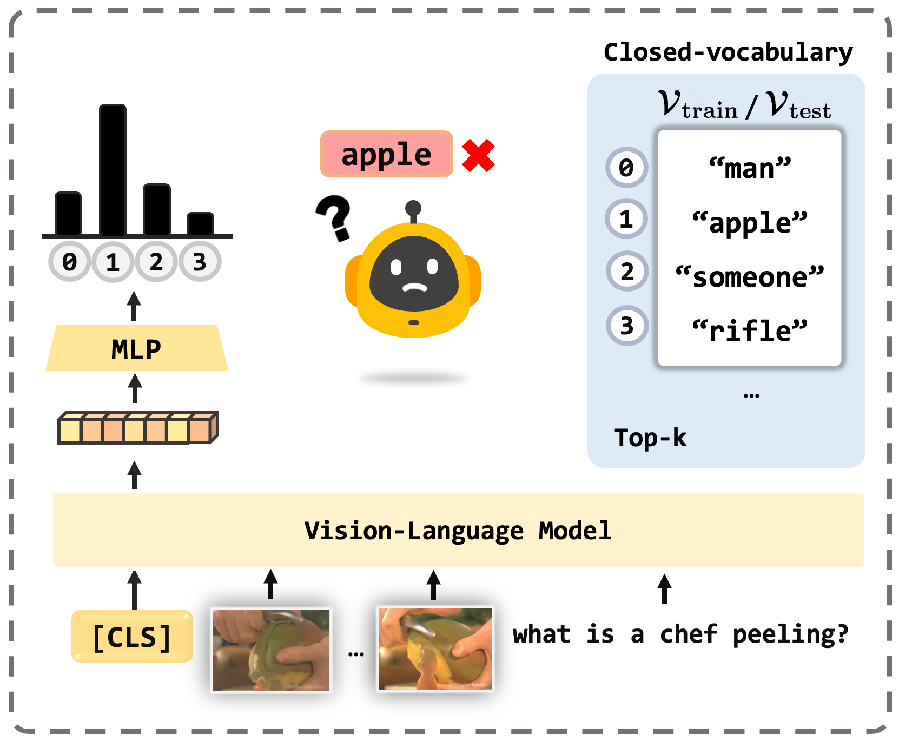
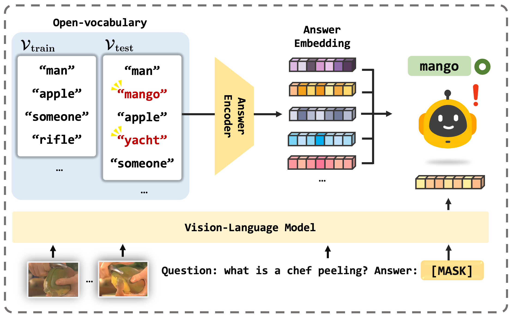

# Open-Vocabulary Video Question Answering: A New Benchmark for Evaluating the Generalizability of Video Question Answering Models

This is the official implementation of OVQA (ICCV 2023). ([arxiv](https://arxiv.org/abs/2308.09363))

> Dohwan Ko, Ji Soo Lee, Miso Choi, Jaewon Chu, Jihwan Park, Hyunwoo J. Kim.
>
> Department of Computer Science and Engineering, Korea University

<div align="center">
  
	
</div>

&nbsp;(a) Closed-vocabulary Video Question Answering                  &nbsp;  &nbsp;&nbsp;&nbsp;         (b) Open-vocabulary Video Question Answering (Ours)


## Setup
To install requirements, run:
```
conda create -n ovqa python=3.8
conda activate ovqa
sh setup.sh
```
## Data Preparation
### Download preprocessed data, visual features
Pretrained checkpoint, preprocessed data, and data annotations are provided [here](https://drive.google.com/drive/folders/1WrZq2kN5n4iWuTGRc9bVmmdZkIlfSDEl). You can download pretrained DeBERTa-v2-xlarge model [here](https://huggingface.co/microsoft/deberta-v2-xlarge).

Then, place the files as follows:

```
./pretrained
   |─ pretrained.pth
   └─ deberta-v2-xlarge
./meta_data
   |─ activitynet
   │	|─ train.csv
   │	|─ test.csv
   │	|─ train_vocab.json
   │	|─ test_vocab.json
   │	|─ clipvitl14.pth
   │	|─ subtitles.pkl
   │	|─ ans2cat.json
   │	└─ answer_graph
   │       |─ train_edge_index.pth
   │       |─ train_x.pth
   │       |─ test_edge_index.pth
   │       └─ test_x.pth
   │
   |─ msvd
   │	|─ train.csv
   │	|─ test.csv
   │	|─ train_vocab.json
   │	|─ test_vocab.json
   │	|─ clipvitl14.pth
   │	|─ subtitles.pkl
   │	|─ ans2cat.json
   │	└─ answer_graph
   │       |─ train_edge_index.pth
   │       |─ train_x.pth
   │       |─ test_edge_index.pth
   │       └─ test_x.pth
   │  :
```


## Train FrozenBiLM+ on OVQA

To train on ActivityNet-QA, MSVD-QA, TGIF-QA, and MSRVTT-QA, run below command. You can modify `--dataset activitynet ` to change dataset.

```
python -m torch.distributed.launch --nproc_per_node 4 --use_env train.py --dist-url tcp://127.0.0.1:12345 \
--dataset activitynet --lr 5e-5 --batch_size 8 --batch_size_test 32 --save_dir ./path/to/save/files --epochs 20 --eps 0.7
```


## Acknowledgements
This repo is built upon [FrozenBiLM](https://github.com/antoyang/FrozenBiLM).


## Citation 
```
@inproceedings{ko2023open,
  title={Open-vocabulary Video Question Answering: A New Benchmark for Evaluating the Generalizability of Video Question Answering Models},
  author={Ko, Dohwan and Lee, Ji Soo and Choi, Miso and Chu, Jaewon and Park, Jihwan and Kim, Hyunwoo J},
  booktitle={Proceedings of the IEEE/CVF international conference on computer vision},
  year={2023}
}
```
